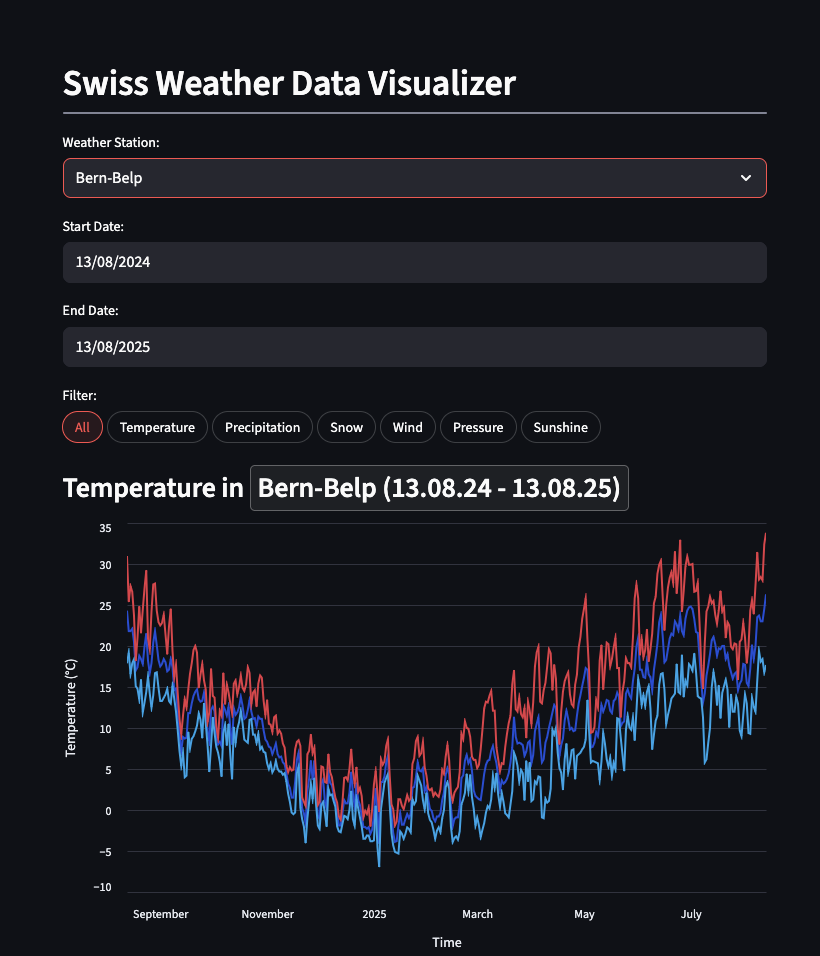

# Swiss Weather Tracker

Swiss Weather Tracker lets users visualize weather data from stations across Switzerland.

The app is built with Streamlit and uses the [Meteostat Python library](https://dev.meteostat.net/python/) to access historical weather and climate data aggregated from various public sources.

## Features

- **Weather Station Selection**: Select individual weather stations.
- **Start/End Date Selection**: Select a date range of to visualize weather metrics within a specific time span.
- **Metric Filtering**: Filter by different weather metrics such as temperature, precipitation, and more.
